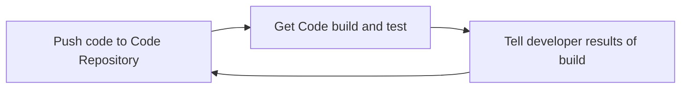
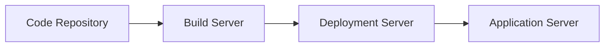

# AWS CICD 
## Continuous Integration

## Continuous Delievery

Tech Stack
Code - AWS Code Commit/ Github / Bitbucket
Build and Test - AWS CodeBuild/ Jenkins / Travis / Teamcity
Deploy - AWSCodeDeploy EC2Instances / ElasticBeanstalk
to orchestrate all these things we need AWS CodePipeline

**AWS COdeCommit** - storing our code 
**AWS CodePipeline** - automating our pipeline from code to Elastic Beanstalk
**AWS CodeBuild** - building and testing our code 
**AWS CodeDeploy** - deploying the code to EC2 instances(not Elastic Beanstalk)
**AWS CodeStar** - manage software development activities in one place 
**AWS CodeArtifact** - stoer, publih, and share software packages
**AWS CodeGuru** - automated code reviews using Machine Learning

	
<h2>AWS Code Commit</h2>

	 

	
<h2>AWS Code Pipeline</h2>

	
<h2>AWS Code Build</h2>

	
<h2>AWS Code Deploy</h2>

