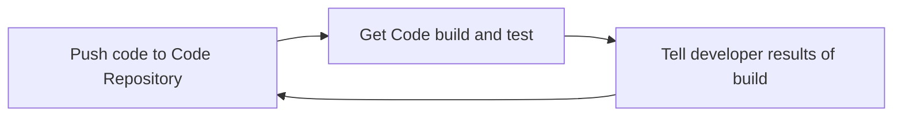
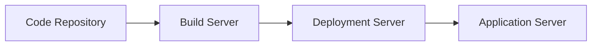

# AWS CICD 
## Continuous Integration

```mermaid
graph LR
A[Push code to Code Repository] -->B[Get Code build and test]
    B --> C[Tell developer results of build]
    C -->A
```
## Continuous Delievery

```mermaid
graph LR
A[Code Repository] -->B[Build Server]
	B-->C[Deployment Server]
	C-->D[Application Server]
```

	
<h2>AWS Code Commit</h2>

	 

	
<h2>AWS Code Pipeline</h2>

	
<h2>AWS Code Build</h2>

	
<h2>AWS Code Deploy</h2>

