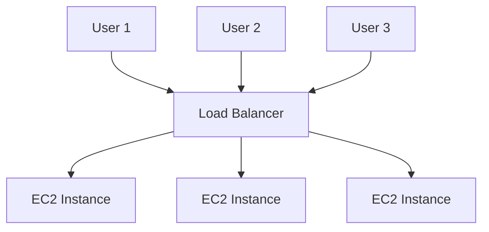

# AWS

## IAM 
- Identity and Access Management -> A Global Service Because in IAM we are creating users and will assign them to groups.    
- The Root account created should not be used or shared.  
- Users are people within your organisation and can be grouped.  
- Groups only contains users and not other groups.  
- Users don't have to belong to a group and a user can belong to multiple groups.  
- Users or Groups can be assigned JSON documents called Policies. These policies define the permisssions of the users.  
- In AWS we apply the least privilege principle i.e. don't give more permissions than a user needs.  

## How users can access AWS  
- AWS Management Console (protected by password + MFA)  
- AWS CLI (protected by access keys)  
- AWS SDK (for code: protected by access keys)  

## Access Keys  
- These are generated through AWS console.  
- Users can manage their own access keys.  
- Access Key ID similar to username and Secret Access Key similar to password.  

## IAM Security tools  
- IAM Credentials Report(account-level) a report that lists all your account's users and the status of their various credentials.  
- IAM Access Advisor(user-level) shows the service permissions granted to a user and when those services were last accessed. You can use these permissions to revise your policies.  
## AWS BUDGET SETUP  
- From root account allow IAM user to access the billing information.  
- Billing -> Budgets -> Create Budget -> Cost Budget -> Setup ur budget    

## EC2 - Elastic Compute Cloud - Infrastructure as a Service.  
It mainly consists in the capability of:
- Renting Virtual Machines (EC2)
- Storing data on virtual drives (EBS)
- Distributing load across machines (ELB)
- Scaling the services using and Auto Scaling Group (ASG)

### EC2 Sizing and Configuration Options  
- Operating System: Linux, Windows, MacOS  
- How much computer power and cores (CPU)  
- How much RAM  
- How much storage space :  
- - Network attached (EBS and EFS)  
- - Hardware attached (EC2 instance store)  
- Network card: Speed of the card, Public IP address  
- Firewall rules: security group  
- Bootstrap Script (configure at first launch): EC2 User Data

### EC2 user data
- Is it possible to bootstrap our instances using an EC2 User Data script.  
- bootstraping means launching commands when a machine starts.  
- That script is run only once at the instance first start.  
- EC2 user data is used to automate boot tasks such as: Installing updates, Installing software, Downloading common files from internet etc. 
- EC2 user data scripts run with the root user.  i.e any command you write must have the sudo rights.  

### Creating an EC2 Instance  
Services -> EC2 -> Instances -> Launch Instances -> Now choose an AMI(Amazon Machine Image) Choose Free tier AMIs -> Choose Instance Type t2.micro(Free) -> Configure Instance Details network vpc (virtual private cloud) Can also add user data which would run first at the launch of ec2 instance -> Create a new Key Pair 
### Types of EC2 instances https://aws.amazon.com/ec2/instance-types/
### m5.2xlarge
- m : instance class
- 5 : generation (AWS improves over time)
- 2xlarge : size within the instance class 

General Purpose Instances  
- Great for diversity of workloads such as web servers or code repositories  
- Good Balance b/w Compute, Memory and Networking t2.micro is an example of General Purpose EC2 Instance  

Compute Optimized Instances  
- Great for compute-intensive tasks that require high performance processors  
- Batch processing workloads, Media transcoding, high performance web servers, high performance computing, scientific modeling and machine learning and dedicated gaming servers.  
Memory Optimized Instances  
- Fast performance workloads that process large data sets in memory  
- High performance, relational/non-relational databases, Distributed web scale cache stores, In memory databases optimized for Businsess Intelligence, Applications performing real-time processing of big unstructured data.  

Storage Optimized Instances  
- Great for storage intensice tasks that require high, sequential read and write access to large data sets on local storage.  
- High frequency online transaction processing (OLTP) systems, Relational and No SQL Databases, Cache for in memory databases eg redis, Data warehousing applications, Distributed file systems  

__[EC2 instances info](https://instances.vantage.sh/)__

## Security Groups
- Security groups are fundamentals of network security in AWS 
- They control how traffic is allowed into or out of our EC2 instances.  
- Security groups only contain allow rules.  
- Security groups rules can reference by IP or by security group. 
- Act as firewall on ec2 intances.  
- They regulate : Access to ports, Authorised IP ranges IPv4 and IPv6 , Control of inbound network(from other to the instance), Control of outbound network(from intance to the other)

| Type | Protocol | Port Range | Source | Description | 
| --- | --- | --- | --- | --- | 
| type of connection | TCP | the port of the instance | Represent an ip address | Description for your notes | 

- Security Groups can be attached to multiple instances 
- Locked down to a region or VPC combination 
- Does live outside the EC2 if traffic is blocked the EC2 instance won't see it  
- Its good to maintain one separate security group for SSH access 
- If application is not accessible (time out), this is an security group issue. 
- If application gives a connection refused error, then it's application error or it's not launched 
- All inbound traffic is blocked by default 
- All outbound traffic is authorised by default 

Classic ports to know 
22 = SSH (Secure Shell) - log into a Linux instance
21 = FTP (File Transport Protocol) - upload files into a file share 
22 = SFTP (Secure File Transport Protocol) - upload files using SSH 
80 = HTTP - access unsecured websites 
443 = HTTPS - access secured websites
3389 = RDP (Remote Desktop Protocol) - log into a Windows instance 

## EC2 Instance Storage 

**_EBS VOLUME_**

- An Elastic BLock Store is a network drive you can attach to your instances  
while they run
- It allows your instances to persist data, even after their termination
- They can only be mounted to **One instance at a time** 
- They are bound to a specific availaibility zone 
- Free Tier: 30GB of free EBS Storage of type General Purpose(SSD) or Magnetic per month 
- By default only the root EBS Volume will be deleted once we delete the ec2 instance associated with it and the extra EBS Volume attached needs to be delete manually 
- *_Types of EBS Volume_*:
  - gp2/gp3 : General Purpose SSD Volume that balances price and performance for a wide variety of workloads.
  - io1/io2 : Highest performance SSD volume for mission-critical low-latency or high-throughput workloads.
  - st1 : Low Cost HDD volume designed for frequently accessed, throughput intensive worloads
  - st2 : Lowest Cost HDD Voluem desigend for less frequently accessed workloads.
 

**EBS Snapshots**

- Make a backup (snapshot) of your EBS Volume at a point in time 
- Not necessary to detach volume to do snapshot, but recommended 
- Can copy snapshots across Availaibility Zones or Regions 

**AMI (_Amazon Machine Image_)**

- These are customization of an EC2 instance 
  - You add your own software, configuration, operating system, monitoring etc. 
  - Faster boot, configuration time because all your software is pre-packaged. 
- AMI are built for a specific region (and can be copied across regions)
- We can launch EC2 instances from
  - _Public AMI_: Provided by AWS
  - _Your own AMI_: You make and maintain them yourself
  - _An AWS Marketplace AMI_: An AMI someone else made (and potentially sells)
- _AMI Process From an EC2 instance_: 
  - Start an EC2 instance and customize it 
  - Stop the instance for data integrity 
  - Build and AMI - this will also create EBS Snapshots 
  - Launch instances from other AMIs
 
 ### EC2 Instance Store 
 - EBS volumes are network drives with _good_ but _limited_ performance
 - If you need a high performance hardware disk, use EC2 Instance Store 
 - __Pros__: 
   - Better Performance 
   - Good for buffer/ cache/ scratch data/ temporary content
 - Cons:
  - EC2 Instance Store lose their storage if they're stopped.  
  - Risk of data loss if hardware fails
  - Backups and Replication are your responsibility 
### Scalability and High Availaibility
  - Scalability means application can handle greater loads by adapting Vertical Scalability or Horizontal Scalability
    - _Vertical Scalability_ Increase the size of the instance ex. switching from t2.micro to t2.large
    - _Horizontal Scalability_ Increase the no. of instances/systems for application ex. increasing the count of t2.micro
  - High Availability means running your application in atleast two data centers or Availability zones.
### Load Balancing
  - These are servers that forward internet traffic to multiple servers(EC2 instances) downstream
  - Spread across multiple downstream instances
  - Expose a single point of access(DNS) to your application
  - Seamlessly handle failures of downstream instances
  - Do regular health checkups for your instances so it may know when not to send traffic to your instances
  - Provide SSL termination(HTTPS) for your websites
  - Enforce stickiness with cookies
  - High availability across zones
  - Separate public traffic from private traffic 
  - __Why to Use__
    - It is a managed load balancer
    - AWS guarantess it will be working
    - AWS take care of upgrades, maintainance and high avaialability
    - It costs less to setup your own load balancer but it will be a lot more effor on your end
    - The health checkup is done on a port and a route _/health_ which is common 
    - If response is not 200 Ok then instance is unhealthy
  - Load Balancer Securtiy groups i.e only allow ec2 instances to accept traffic from load balancer 
  - 🔴 Load Balancers can scale but not intantaneously

**_Types of Load Balancers_**
  - Classic Load Balancer(v1- old generation -2009)
    - HTTP, HTTPS, TCP
  - Application Load Balancer(v2 - new generation 2016)
    - HTTP, HTTPS, WebSocket
  - Network Load Balancer(v2 - new generation 2017)
    - TCP, TLS(Secured TCP) & UDP
  - We can setup public(external) or private(internal) Load Balancers

```console
sudo yum install -y bind-utils
```
this comand will install both nslookup and dig 
