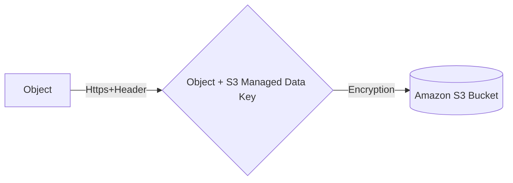
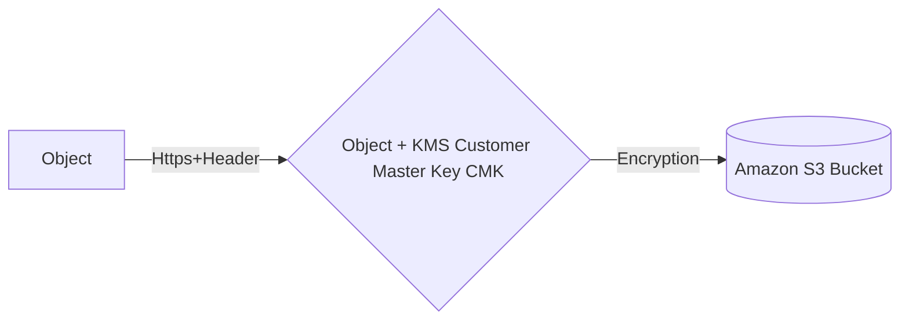
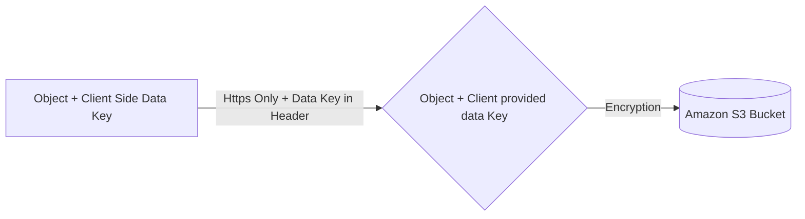
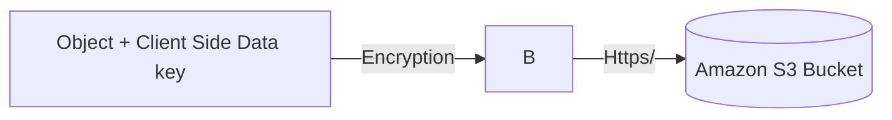

# S3 
**_Max Object size_** **5TB**
**_

**_S3 Encryption for Objects_**
**4 Methods**
- **SSE-S3**: Encrypts S3 using keys handled and managed by AWS 
- **SSE-KMS**: leverage AWS Key Management Service to manage encryption keys
- **SSE-C**: when you want to manage your own encryption keys 
- **Client Side Encrytpion**

**_SSE S3_** (_Server Side Encryption_)
- Object is encrypted server side 
- AES-256 type of encryption 
- Must Set header : "x-amz-server-side-encryption":"AES256"


**_SSE KMS_** (_Key Management Service_)
- Encryption using keys handled and managed by KMS
- KMS advantages: user control + audit trail
- Object is encrypted server side 
- Must set header: "x-amz-server-side-encryption":"aws:kms"


**_SSE C_** 
- Server Side Encryption using data keys fully managed by the customer outside of AWS 
- Amazon S3 does not store the encryption keys you provide
- HTTPS must be used 
- Encryption Key must be provided in HTTP headers for every HTTP request made 



**_Client Side Encryption_** 
- Client library such as Amazon S3 Encryption Client
- Client must encrypt data themselves before sending to S3
- Client must decrypt data themselves when retrieving from S3
- Customer fully manages the keys and encryption cycle 



**_Encrption in Transit(SSL/TLS)_**
- Amazon S3 exposes 
  - HTTP Endpoint: non encrypted
  - HTTPS Endpoint: encryption in flight/SSLor TLS which relies on SSL and TLS certificates
  - You are free to use the endpoint you want but HTTPS is recommended
  - Most Clients will use HTTPS by default 
  - HTTPS is mandatory for SSE-C 
  
**_S3 Security_**
- User Based 
  - IAM Policies - which API calls should be allowed for a specific user from IAM console 
- Resource Based 
  - Bucket Policies - bucket wide rules from the S3 console - allows cross account 
  - Object Access Control List (ACL) - finer grain 
  - Bucket Access Control List (ACL) - less common 
 ##### An IAM Principal can access an S3 object if 
 - The user IAM permissions allow it or the resource policy allows it and there is no expicity deny

**_S3 Bucket Policies_**  
JSON Based policies :
- Resource - Buckets and objects
- Actions - Set of API to allow or deny
- Effect - Allow/Deny
- Principal - The account or user to apply the policy to 

USE S3 Bucket polices to 
- Grant public access to the bucket
- Force objects to be encrypted at upload 
- Grant access to another account(Cross Account)

**_Bucket settings to block public access_**
- Block public access to buckets and objects granted through 
  - new access control list
  - any access control list 
  - new public bucket or access point policies 
- Block public and cross account access to buckets and objects through any public bucket or access point policies 
- These settings were created to prevent company data leaks 

Other methods of S3 Security
- Networking : Supports VPC Endpoints (for instances in VPC without www internet)
- Logging and Audit 
  - S3 Access Logs can be stored in other S3 bucket
  - API calls can be logged in AWS Cloud Trail 
- User Security 
  - MFA Delete : MFA can be required in versioned buckets to delete objects
  - Pre-Signed URLs: URLs that are valid for a limited time 
```json 
{    
    "Version": "2022-02-07",
    "Statement": [
         {    
             "Sid": "PublicRead",
             "Effect": "Allow",
             "Principal":"*",
             "Action":[
                  "s3:GetObject",
                  ],
             "Resource":[
                 "arn:aws:s3:::exampleBucket/*"
                 ]
         }
         ]
}
```

### Generate Presigned url using aws cli 
```console
aws s3 presign s3://bucket_name/object_name  --region my-region
aws s3 presign s3://bucket_name/object_name  --expires-in 300 --region my-region
```
if not working then set the proper signature version in order not to get issues while generating urls for encrypted files
```console
aws configure set default.s3.signature_version s3v4
```
