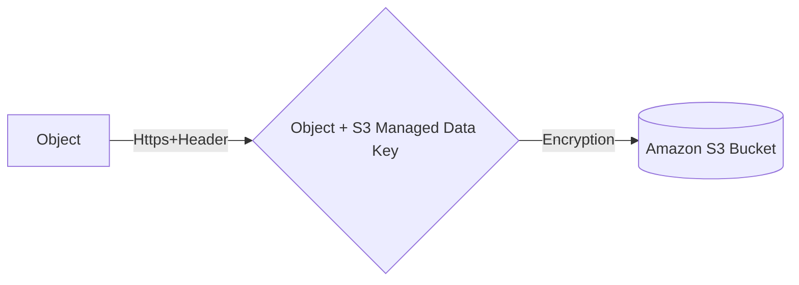
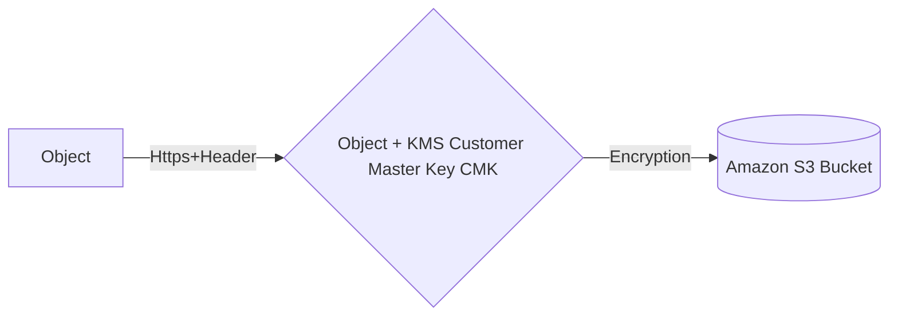
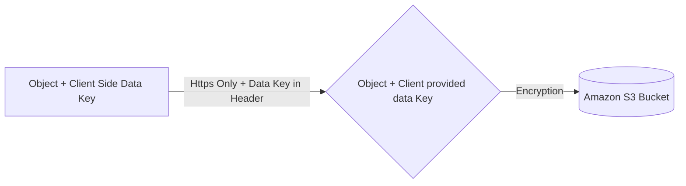

# S3 
**_Max Object size_** **5TB**
**_

**_S3 Encryption for Objects_**
**4 Methods**
- **SSE-S3**: Encrypts S3 using keys handled and managed by AWS 
- **SSE-KMS**: leverage AWS Key Management Service to manage encryption keys
- **SSE-C**: when you want to manage your own encryption keys 
- **Client Side Encrytpion**

**_SSE S3_** (_Server Side Encryption_)
- Object is encrypted server side 
- AES-256 type of encryption 
- Must Set header : "x-amz-server-side-encryption":"AES256"

**_SSE KMS_** (_Key Management Service_)
- Encryption using keys handled and managed by KMS
- KMS advantages: user control + audit trail
- Object is encrypted server side 
- Must set header: "x-amz-server-side-encryption":"aws:kms"

**_SSE C_** 
- Server Side Encryption using data keys fully managed by the customer outside of AWS 
- Amazon S3 does not store the encryption keys you provide
- HTTPS must be used 
- Encryption Key must be provided in HTTP headers for every HTTP request made 

